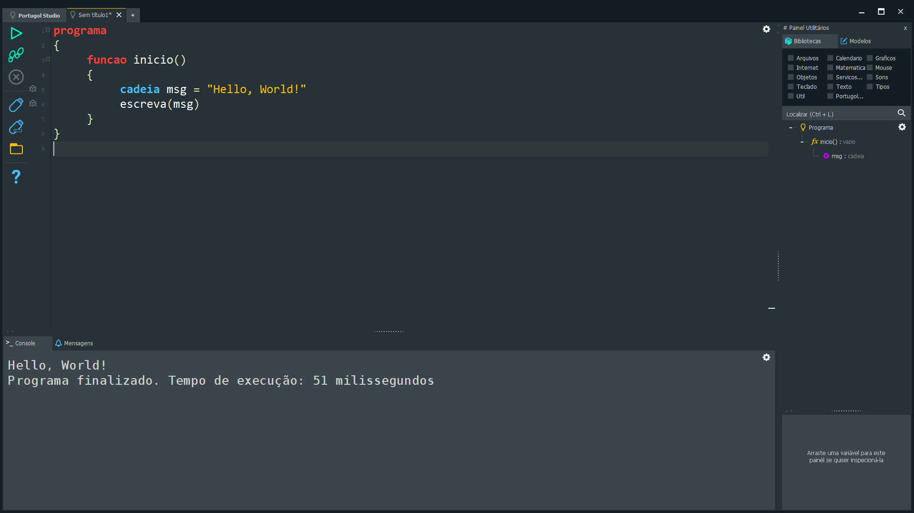
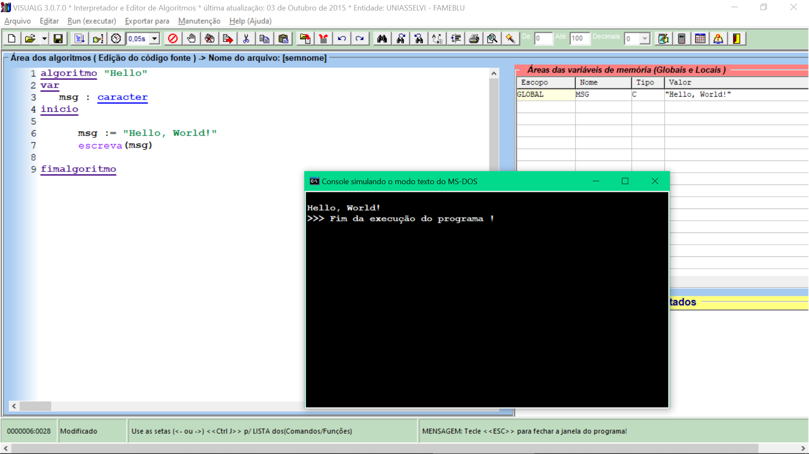
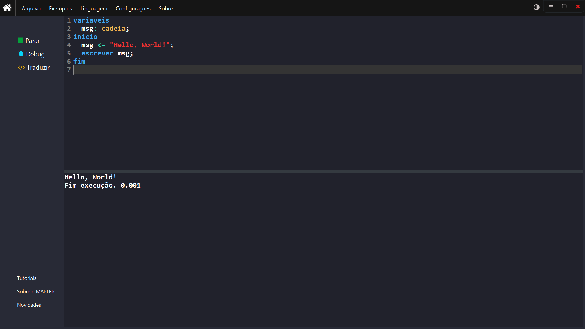

<div id="intro" align="center">
    <!-- CABEÇALHO -->
    <a href="./src/portugol/README.md" title=" ">
        
    </a>
    <!-- ESCRITA DINÂMICA -->
    <a href="#none" title=" ">
        
      </a>
</div>

## **_Contexto_** 📰

Repositório dedicado aos estudos em pseudocódigo. Haverá uma ênfase maior para a sintaxe do [Portugol Studio](https://univali-lite.github.io/Portugol-Studio/), mas não tira o mérito das outras opções: [Visualg](https://sourceforge.net/projects/visualg30/), [Mapler Studio](https://portugol.sourceforge.io/) e [Linguagem Égua](https://egua.dev/).

### **_Definição_** 📜

> Pseudocódigo é uma linguagem estruturada que mescla a sintaxe de uma linguagem de programação com a descrição narrativa. Seu propósito está na generalização de sintaxe, não se apegando às peculiaridades de cada linguagem de programação, tal como C, C++, Java, Javascript, PHP etc.

### **_Função_** 🔧

> Como mencionado, pseudocódigo é uma estrutura sintaticamente lógica que simula uma linguagem de programação com o propósito de abstrair peculiaridades. Assim como uma linguagem qualquer, o pseudocódigo **_busca representar uma sequência lógica de passos para a definição de uma possível solução de problema_**.

### **_Lista de Conteúdos_** 📚

- [ ] Variáveis e Constantes
- [ ] Instruções I/O
- [ ] Operadores
- [ ] Bibliotecas Internas
- [ ] Controle de Fluxo
- [ ] Vetores e Matrizes
- [ ] Procedimentos e Funções
- [ ] Manipulação de Arquivos
- [ ] Interfaces Gráficas

<details>
    <summary><em><strong>Diretórios</strong></em> 📂</summary>

```shell
pseudocode
├───.vscode          # Configs para o VS Code
├───assets           # Recursos de imagens
└───src              # Código-Fonte
    ├───portugol         # Algoritmos em Portugol
    └───visualg          # Algoritmos em Visualg
```

</details>

### **_Interface de cada Ferramenta_**

| ✨ **_Portugol Studio_** ✨ |
| --------------------------- |

[](./src/portugol/README.md)

| ✨ **_Visualg_** ✨ |
| ------------------- |

[](#interface-de-cada-ferramenta)

| ✨ **_Mapler Studio_** ✨ |
| ------------------------- |

[](#interfaces-da-ferramentas)
