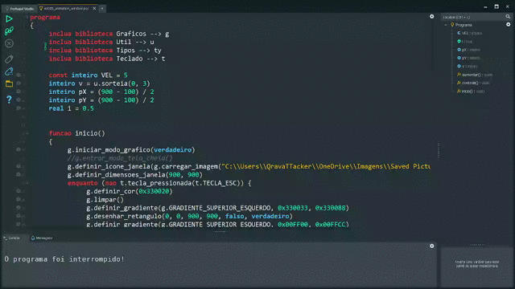

<h2 align="center">✨ <em><strong>Portugol Studio</strong></em> ✨</h2>

### **_Sobre_** 🔍

[Portugol Studio](https://univali-lite.github.io/Portugol-Studio/) é um software que proporciona um ambiente de aprendizagem inclinado à programação base. Ele engloba tanto uma interface para o desenvolvimento, quanto uma linguagem de sintaxe única que, segundo o próprio time de desenvolvedores, é baseada nas linguagens C e PHP, apesar de ter fortes semelhanças com outras linguagens.

O Portugol Studio é um dos principais projetos do **Laboratório de Inovação Tecnológica na Educação** ([LITE](http://lite.acad.univali.br/pt/)) que, de acordo com uma autodefinição em suas mídias, "_é um espaço que integra a pesquisa, o desenvolvimento de produtos e processos tecnológicos voltados à atividades educacionais_".

Todo esse ecossistema foi planejado e desenvolvido por uma equipe de desenvolvedores **brasileiros da fundação UNIVALE**. Atualmente, ele é um software mantido sobre licença [LGPL-3](https://opensource.org/license/lgpl-3-0/) e seu código-fonte está acessível para a toda a comunidade no [GitHub](https://github.com/UNIVALI-LITE/Portugol-Studio).

<div>
  <a alt="QR code para o Portugol Mobile" href="#✨-portugol-studio-✨" >
    
  </a>
</div>

### **_Recursos_** 📚

<div align="justify">

- **Rápido e Prático**: O Portugol tem uma interface limpa e intuitiva. O seu editor possui um verificador de sintaxe, coloração de código, teclas de atalho, formatação e sugestão de preenchimento automático.

- **Documentação Embutida**: Ao pressionar a tecla F1, o aluno pode acessar um painel de ajuda contendo informações de cada recurso e função interna do Portugol.

- **Execução e Depuração**: Os algoritmos com a extensão **.por** podem ser executados em um console embutido, além disso, ele permite depurar seu código ao inserir pontos de parada na lateral da linha desejada.

- **Módulos Internos**: É incluso uma vasta gama de módulos internos que permitem trabalhar com cálculos matemáticos, validações de tipos, interfaces gráficas, manipulação de arquivos, monitoramento do teclado/mouse etc.

- **Multiplataforma**: Pode ser usado nos sistemas mais familiares, o Portugol possui versões para Windows, MacOS, distribuições Linux, além de incluir versões para a Web e Mobile (QR Code ao lado levará para a Play Store).

</div>

### **_Principais Módulos_** 📦

- **Calendario**: Permite identificar datas e horário do sistema.
- **Graficos**: Permite criar interfaces gráficas.
- **Matematica**: Permite realizar cálculos matemáticos mais aprimorados.
- **Mouse**: Permite monitorar o mouse (Modo gráfico deve ser iniciado).
- **Sons**: Permite carregar e trabalhar com áudios.
- **Teclado**: Permite monitorar o teclado (Modo gráfico deve ser iniciado).
- **Texto**: Permite manipular textos.
- **Tipos**: Permite realizar verificações e conversões de tipos.

<div align="center">

[](#principais-módulos-📦)

</div>

<!-- ### **_Material de Apoio_** 📝

<details>
      <summary>
            <em><strong>MÓDULO 1 - Princípios Básicos</strong></em>
      </summary>
</details>
<details>
      <summary>
            <em><strong>MÓDULO 2 - Módulos Internos</strong></em>
      </summary>
</details>
<details>
      <summary>
            <em><strong>MÓDULO 3 - Controle de Fluxos (Desvios)</strong></em>
      </summary>
</details>
<details>
      <summary>
            <em><strong>MÓDULO 4 - Controle de Fluxos (Ciclos)</strong></em>
      </summary>
</details>
<details>
      <summary>
            <em><strong>MÓDULO 5 - Variáveis Compostas</strong></em>
      </summary>
</details>
<details>
      <summary>
            <em><strong>MÓDULO 6 - Rotinas</strong></em>
      </summary>
</details> -->

### **_Lista de Exercícios_** 💡

```js
/*
 * Crie um programa em Portugol que mostre 'Hello, World!' no console.
 */

programa
{
	funcao inicio()
	{
		escreva("Hello, World!")
	}
}
```

<!--
* ███╗   ███╗ ██╗              ██████╗  █████╗ ███████╗██╗ ██████╗ ██████╗
* ████╗ ████║███║              ██╔══██╗██╔══██╗██╔════╝██║██╔════╝██╔═══██╗
* ██╔████╔██║╚██║    █████╗    ██████╔╝███████║███████╗██║██║     ██║   ██║
! ██║╚██╔╝██║ ██║    ╚════╝    ██╔══██╗██╔══██║╚════██║██║██║     ██║   ██║
! ██║ ╚═╝ ██║ ██║              ██████╔╝██║  ██║███████║██║╚██████╗╚██████╔╝
! ╚═╝     ╚═╝ ╚═╝              ╚═════╝ ╚═╝  ╚═╝╚══════╝╚═╝ ╚═════╝ ╚═════╝
-->

<details>
      <summary>
            <em><strong>MÓDULO 1 - Princípios Básicos</strong></em>
      </summary>

- [x] [**_Ex001_**](./exercicios/modulo_1/ex001.por):
      Programa para dar boas-vindas ao usuário.

- [ ] [**_Ex002_**](./exercicios/modulo_1/ex002.por):
      Programa para ler dois valores inteiros e mostrar a soma entre eles.

- [x] [**_Ex003_**](./exercicios/modulo_1/ex003.por):
      Programa para ler um número inteiro e mostrar seu antecessor e sucessor.

- [x] [**_Ex004_**](./exercicios/modulo_1/ex004.por):
      Programa capaz de ler dois números reais e realizar as quatro operações entre eles.

- [ ] [**_Ex005_**](./exercicios/modulo_1/ex005.por):
      Programa que mostra a divisão real, divisão inteira e o módulo entre dois valores.

- [ ] [**_Ex006_**](./exercicios/modulo_1/ex006.por):
      Programa que mostra o dobro e triplo de um valor real.

- [x] [**_Ex007_**](./exercicios/modulo_1/ex007.por):
      Programa para ler o nome, ano de nascimento e salário de um funcionário,
      mostrando, em seguida, sua ficha funcional.

- [ ] [**_Ex008_**](./exercicios/modulo_1/ex008.por):
      Programa que mostra a idade de uma pessoa no ano de 2077 conforme o seu ano de nascimento.

- [ ] [**_Ex009_**](./exercicios/modulo_1/ex009.por):
      Programa que leia um número real qualquer e mostre a sua porção inteira.

- [ ] [**_Ex010_**](./exercicios/modulo_1/ex010.por):
      Programa que leia quantas fatias tem uma pizza e a quantidade de pessoas para reparti-la.
      O programa deve mostrar quantas fatias são partilhadas para cada pessoa.

- [ ] [**_Ex011_**](./exercicios/modulo_1/ex011.por):
      Programa que mostra a tabuada de um número real.

- [x] [**_Ex012_**](./exercicios/modulo_1/ex012.por):
      Programa para ler uma distância (m) e convertê-la em todas as demais
      medidas de comprimento.

  - Quilômetro (km) = 1000 m
  - Hectômetro (hm) = 100 m
  - Decâmetro (dam) = 10 m
  - Decímetro (dm) = 0,1 m
  - Centímetro (cm) = 0,01 m
  - Milímetro (mm) = 0,001 m

- [x] [**_Ex013_**](./exercicios/modulo_1/ex013.por):
      Programa para ler a largura (m) e altura (m) de uma parede retangular.
      O programa vai calcular a área (m²) da parede, além da quantidade de tinta
      necessária para pintá-la, sabendo que cada litro de tinta pinta 2 m² de parede.

- [ ] [**_Ex014_**](./exercicios/modulo_1/ex014.por):
      Programa que mostra a tabela verdade para todos os casos do operador de negação,
      conjunção e disjunção inclusiva.

- [ ] [**_Ex015_**](./exercicios/modulo_1/ex015.por):
      Programa que mostra se um número é par.

- [ ] [**_Ex016_**](./exercicios/modulo_1/ex016.por):
      Programa que mostra se um número é múltiplo de 2 e divisível por 5.

- [ ] [**_Ex017_**](./exercicios/modulo_1/ex017.por):
      Programa que mostra se um número está no intervalo de 1 a 10.

- [ ] [**_Ex018_**](./exercicios/modulo_1/ex018.por):
      Programa que mostra se um valor está no intervalo de 1 a 10 ou no intervalo de -10 a -5.

- [x] [**_Ex019_**](./exercicios/modulo_1/ex019.por):
      Programa para ler o preço de um produto e aplicar 5% de desconto ao valor.

- [ ] [**_Ex020_**](./exercicios/modulo_1/ex020.por):
      Programa para ler o salário de um funcionário e aplicar um reajuste (aumento)
      de acordo com a taxa de acréscimo.

- [ ] [**_Ex021_**](./exercicios/modulo_1/ex021.por):
      Programa que mostra o ganho total de um funcionário conforme a quantidade de
      horas que ele trabalhou e o valor que ele recebe por hora.

- [ ] [**_Ex022_**](./exercicios/modulo_1/ex022.por):
      Programa que pergunte a quantidade de km percorridos por um carro alugado
      e a quantidade de dias pelos quais ele foi alugado. Calcule o preço a pagar,
      sabendo que o carro custa R$ 60 por dia e R$ 0,15 por km rodado.

- [x] [**_Ex023_**](./exercicios/modulo_1/ex023.por):
      Programa que calcula quantos dias de vida um fumante perdeu.
      Considere, para a base de cálculo, que a cada cigarro consumido,
      reduz o tempo de vida do fumante em 10 minutos. O programa deve perguntar a quantidades
      de anos que a pessoa fuma.

- [ ] [**_Ex024_**](./exercicios/modulo_1/ex024.por):
      Programa que mostra a massa ideal (kg) de uma pessoa conforme a sua altura (m):

<pre>
      <code>massa_ideal = 72.7h - 58</code>
</pre>

- [ ] [**_Ex025_**](./exercicios/modulo_1/ex025.por):
      Programa que calcula o IMC (Índice de Massa Corporal) de uma pessoa conforme a sua massa (kg)
      e sua altura (m).

<pre>
      <code>IMC = m / h<sup>2</sup></code>
</pre>

- [ ] [**_Ex026_**](./exercicios/modulo_1/ex026.por):
      Programa que calcula o consumo de litros (L) de um automóvel conforme a taxa de consumo (L/km)
      e sua distância percorrida (km).

<pre>
      <code>consumo = km * taxa</code>
</pre>

- [ ] [**_Ex027_**](./exercicios/modulo_1/ex027.por):
      Programa que converta de reais (BRL) para dólares (US).

<pre>
      <code>U$ 1,00 = R$ 5,05</code>
</pre>

- [ ] [**_Ex028_**](./exercicios/modulo_1/ex028.por):
      Programa que converta de quilograma para gramas.

<pre>
      <code>1kg = 1000g</code>
</pre>

- [ ] [**_Ex029_**](./exercicios/modulo_1/ex029.por):
      Programa que converta de gigabytes para bytes.

<pre>
      <code>1GB = 1024<sup>3</sup>b</code>
</pre>

- [ ] [**_Ex030_**](./exercicios/modulo_1/ex030.por):
      Programa que calcula a quantidade de litros para um determinado volume (m³).

<pre>
      <code>1m<sup>3</sup> = 1000L</code>
</pre>

- [ ] [**_Ex031_**](./exercicios/modulo_1/ex031.por):
      Programa que calcula o perímetro total de um terreno (m). O programa deve
      perguntar a altura e base desse terreno (m).

<pre>
      <code>p = 2b + 2h</code>
</pre>

- [ ] [**_Ex032_**](./exercicios/modulo_1/ex032.por):
      Programa que calcula a circunferência (m) e área (m²) de um círculo conforme o valor
      do raio (m).

<pre>
      <code>C = 2πr</code>
      <code>A = πr<sup>2</sup></code>
</pre>

- [ ] [**_Ex033_**](./exercicios/modulo_1/ex033.por):
      Programa que calcula o volume (m³) de um cilindro conforme um determinado raio (m).

<pre>
      <code>V = hπr<sup>2</sup></code>
</pre>

- [ ] [**_Ex034_**](./exercicios/modulo_1/ex034.por):
      Programa que mostra a velocidade (m/s) de um automóvel conforme o
      deslocamento (m) e o intervalo de tempo (s) gasto para concluir o trajeto.

<pre>
      <code>v = v<sub>0</sub> + ∆x∆t</code>
</pre>

- [ ] [**_Ex035_**](./exercicios/modulo_1/ex035.por):
      Programa que mostra a aceleração (m/s²) de um automóvel conforme a variação de
      velocidade (m/s) em um intervalo de tempo (s).

<pre>
      <code>a = a<sub>0</sub> + ∆v∆t</code>
</pre>

- [ ] [**_Ex036_**](./exercicios/modulo_1/ex036.por):
      Programa que mostra a distância (m) percorrida para um automóvel uniformemente acelerado.

<pre>
      <code>x = x<sub>0</sub> + v<sub>0</sub>t + at<sup>2</sup> / 2</code>
</pre>

- [ ] [**_Ex037_**](./exercicios/modulo_1/ex037.por):
      Programa que mostra a energia cinética (j) de um corpo conforme a sua massa (kg)
      e velocidade (m/s).

<pre>
      <code>Ec = (mv<sup>2</sup>) / 2</code>
</pre>

- [ ] [**_Ex038_**](./exercicios/modulo_1/ex038.por):
      Programa que calcula o peso (N) de uma pessoa na Lua,
      sabendo que sua gravidade é de 1,62 m/s².

<pre>
      <code>p = mg</code>
</pre>

- [ ] [**_Ex039_**](./exercicios/modulo_1/ex039.por):
      Programa que converta uma temperatura digitada em graus Célsius (ºC) e converta
      para graus Fahrenheit (ºF).

<pre>
      <code>F = (9C / 5) + 32</code>
</pre>

- [x] [**_Ex040_**](./exercicios/modulo_1/ex040.por):
      Programa que leia duas notas de um aluno e calcule a sua média final.

<pre>
      <code>media = (nota1 + nota2) / 2</code>
</pre>

- [ ] [**_Ex041_**](./exercicios/modulo_1/ex041.por):
      Programa que mostra a média ponderada de três valores com os pesos P1, P2 e P3.

<pre>
      <code>media_ponderada = (valor1.P1 + valor2.P2 + valor3.P3) / (P1 + P2 + P3)</code>
</pre>

- [ ] [**_Ex042_**](./exercicios/modulo_1/ex042.por):
      Programa que mostra os juros de um produto conforme o seu novo valor.

<pre>
      <code>j = (novo_valor / valor_antigo - 1) * 10<sup>2</sup></code>
</pre>

- [ ] [**_Ex043_**](./exercicios/modulo_1/ex043.por):
      Programa que mostra o montante recebido a partir de um capital inicial, taxa de rendimento e
      período de aplicação (em meses).

<pre>
      <code>M = C.j.∆t</code>
</pre>

- [ ] [**_Ex044_**](./exercicios/modulo_1/ex044.por):
      Programa que mostra o montante recebido a partir de um capital, taxa de rendimento
      acumulado e período de aplicação (em meses).

<pre>
      <code>M = C.(1 + j)<sup>∆t</sup></code>
</pre>

- [ ] [**_Ex045_**](./exercicios/modulo_1/ex045.por):
      Programa que mostra o somatório de 1 até um valor n.

<pre>
      <code>S = n(n + 1) / 2</code>
</pre>

- [ ] [**_Ex046_**](./exercicios/modulo_1/ex046.por):
      Programa que leia um número de 0 a 9999 e mostre na tela cada um dos dígitos
      separados:

<pre>
      Digite um número: 1834
      Milhar: 1
      Centena: 8
      Dezena: 3
      Unidade: 4
</pre>

- [ ] [**_Ex047_**](./exercicios/modulo_1/ex047.por):
      Programa que mostra a quantidade de horas, minutos e segundos a partir de um tempo
      total em segundos. Exemplo:

<pre>
      Total de segundos: 8620
      Tempo convertido: 2 hora(s), 2 minuto(s) e 40 segundo(s)
</pre>

- [ ] [**_Ex048_**](./exercicios/modulo_1/ex048.por):
      Programa que mostra a quantidade de cédulas de 100, 50, 20, 10, 5, 2, e moedas de 1 real
      que ele pode ter a partir de um valor informado. O programa deve se comportar conforme abaixo:

<pre>
      Valor: 273
      Cédulas de 100: 2
      Cédulas de 50: 1
      Cédulas de 20: 1
      Cédulas de 10: 0
      Cédulas de 5: 0
      Cédulas de 2: 1
      Moedas de 1: 1
</pre>

- [x] [**_Ex049_**](./exercicios/modulo_1/ex049.por):
      Programa que aplica a mesma lógica que o [**_Ex048_**](./exercicios/modulo_1/ex048.por), mas incluindo valores fracionais (centavos):

<pre>
      Valor: 143,83
      Cédulas de 100: 1
      Cédulas de 50: 0
      Cédulas de 20: 2
      Cédulas de 10: 0
      Cédulas de 5: 0
      Cédulas de 2: 1
      Moedas de 1: 1
      Moedas de 50: 1
      Moedas de 25: 1
      Moedas de 10: 0
      Moedas de 5: 1
      Moedas de 1: 3
</pre>

- [ ] [**_Ex050_**](./exercicios/modulo_1/ex050.por):
      Programa que mostra o tempo (s) necessário para baixar um arquivo em MB, sabendo que a
      taxa de transmissão é de 2.097.152 bits a cada 40 milissegundos. O programa deverá realizar
      os seguintes passos:

1. Converter a unidade de transmissão para megabytes.

<pre>
      <code>1 byte = 8 bits</code>
      <code>1 megabyte = 1024<sup>2</sup> bytes</code>
</pre>

2. Converter a unidade de tempo para segundos.

<pre>
      <code>1 segundo = 1000 milissegundos</code>
</pre>

3. Determinar a velocidade de download (MB/s).

<pre>
      <code>vel = taxa_mb / tempo_s </code>
</pre>

4. Determinar o tempo (s) para o download.

<pre>
      <code>tempo = arquivo_mb / vel </code>
</pre>

</details>

<!--
* ███╗   ███╗██████╗               ███╗   ███╗ ██████╗ ██████╗ ██╗   ██╗██╗      ██████╗ ███████╗
* ████╗ ████║╚════██╗              ████╗ ████║██╔═══██╗██╔══██╗██║   ██║██║     ██╔═══██╗██╔════╝
* ██╔████╔██║ █████╔╝    █████╗    ██╔████╔██║██║   ██║██║  ██║██║   ██║██║     ██║   ██║███████╗
! ██║╚██╔╝██║██╔═══╝     ╚════╝    ██║╚██╔╝██║██║   ██║██║  ██║██║   ██║██║     ██║   ██║╚════██║
! ██║ ╚═╝ ██║███████╗              ██║ ╚═╝ ██║╚██████╔╝██████╔╝╚██████╔╝███████╗╚██████╔╝███████║
! ╚═╝     ╚═╝╚══════╝              ╚═╝     ╚═╝ ╚═════╝ ╚═════╝  ╚═════╝ ╚══════╝ ╚═════╝ ╚══════╝
-->

<details>
      <summary>
            <em><strong>MÓDULO 2 - Módulos Internos</strong></em>
      </summary>

- [ ] [**_Ex001_**](./exercicios/modulo_2/ex001.por):
      Faça um programa que leia o comprimento do cateto oposto e do cateto adjacente
      de um triângulo retângulo, calcule e mostre o comprimento da hipotenusa.

- [ ] [**_Ex002_**](./exercicios/modulo_2/ex002.por):
      Faça um programa que leia um ângulo qualquer e mostre na tela o valor do seno,
      cosseno e tangente desse ângulo.

- [ ] [**_Ex003_**](./exercicios/modulo_2/ex003.por):
      Programa que leia a cidade onde a pessoa mora, mostre o nome da cidade em caixa
      alta, qual é a primeira letra do nome da cidade e quantas letras ela tem.

- [ ] [**_Ex004_**](./exercicios/modulo_2/ex004.por):
      Crie um programa que leia o nome completo de uma pessoa e mostre:

  - O nome com todas as letras maiúsculas e minúsculas.
  - Quantas letras ao todo (sem considerar espaços).

- [ ] [**_Ex005_**](./exercicios/modulo_2/ex005.por):
      Programa que leia o nome completo de uma pessoa e mostre apenas o primeiro nome dela.

- [ ] [**_Ex006_**](./exercicios/modulo_2/ex006.por):
      Crie um programa que leia o nome de uma cidade e diga se ela começa ou não com o nome "SANTO".

- [ ] [**_Ex007_**](./exercicios/modulo_2/ex007.por):
      Crie um programa que leia o nome de uma pessoa e diga se ela tem "SILVA" no nome.

- [ ] [**_Ex008_**](./exercicios/modulo_2/ex008.por):
      Faça um programa que leia 2 números e mostre qual é o maior e qual é o menor.

- [ ] [**_Ex009_**](./exercicios/modulo_2/ex009.por):
      ...

- [ ] [**_Ex010_**](./exercicios/modulo_2/ex010.por):
      ...

- [ ] [**_Ex011_**](./exercicios/modulo_2/ex011.por):
      ...

- [ ] [**_Ex012_**](./exercicios/modulo_2/ex012.por):
      ...

- [ ] [**_Ex013_**](./exercicios/modulo_2/ex013.por):
      ...

- [ ] [**_Ex014_**](./exercicios/modulo_2/ex014.por):
      ...

- [ ] [**_Ex015_**](./exercicios/modulo_2/ex015.por):
      ...

- [ ] [**_Ex016_**](./exercicios/modulo_2/ex016.por):
      ...

- [ ] [**_Ex017_**](./exercicios/modulo_2/ex017.por):
      ...

- [ ] [**_Ex018_**](./exercicios/modulo_2/ex018.por):
      ...

- [ ] [**_Ex019_**](./exercicios/modulo_2/ex019.por):
      ...

- [ ] [**_Ex020_**](./exercicios/modulo_2/ex020.por):
      ...

- [ ] [**_Ex021_**](./exercicios/modulo_2/ex021.por):
      ...

- [ ] [**_Ex022_**](./exercicios/modulo_2/ex022.por):
      ...

- [ ] [**_Ex023_**](./exercicios/modulo_2/ex023.por):
      ...

- [ ] [**_Ex024_**](./exercicios/modulo_2/ex024.por):
      ...

- [ ] [**_Ex025_**](./exercicios/modulo_2/ex025.por):
      ...

- [ ] [**_Ex026_**](./exercicios/modulo_2/ex026.por):
      ...

- [ ] [**_Ex027_**](./exercicios/modulo_2/ex027.por):
      ...

- [ ] [**_Ex028_**](./exercicios/modulo_2/ex028.por):
      ...

- [ ] [**_Ex029_**](./exercicios/modulo_2/ex029.por):
      ...

- [ ] [**_Ex030_**](./exercicios/modulo_2/ex030.por):
      ...

- [ ] [**_Ex031_**](./exercicios/modulo_2/ex031.por):
      ...

- [ ] [**_Ex032_**](./exercicios/modulo_2/ex032.por):
      ...

- [ ] [**_Ex033_**](./exercicios/modulo_2/ex033.por):
      ...

- [ ] [**_Ex034_**](./exercicios/modulo_2/ex034.por):
      ...

- [ ] [**_Ex035_**](./exercicios/modulo_2/ex035.por):
      ...

- [ ] [**_Ex036_**](./exercicios/modulo_2/ex036.por):
      ...

- [ ] [**_Ex037_**](./exercicios/modulo_2/ex037.por):
      ...

- [ ] [**_Ex038_**](./exercicios/modulo_2/ex038.por):
      ...

- [ ] [**_Ex039_**](./exercicios/modulo_2/ex039.por):
      ...

- [ ] [**_Ex040_**](./exercicios/modulo_2/ex040.por):
      ...

- [ ] [**_Ex041_**](./exercicios/modulo_2/ex041.por):
      ...

- [ ] [**_Ex042_**](./exercicios/modulo_2/ex042.por):
      ...

- [ ] [**_Ex043_**](./exercicios/modulo_2/ex043.por):
      ...

- [ ] [**_Ex044_**](./exercicios/modulo_2/ex044.por):
      ...

- [ ] [**_Ex045_**](./exercicios/modulo_2/ex045.por):
      ...

- [ ] [**_Ex046_**](./exercicios/modulo_2/ex046.por):
      ...

- [ ] [**_Ex047_**](./exercicios/modulo_2/ex047.por):
      ...

- [ ] [**_Ex048_**](./exercicios/modulo_2/ex048.por):
      ...

- [ ] [**_Ex049_**](./exercicios/modulo_2/ex049.por):
      ...

- [ ] [**_Ex050_**](./exercicios/modulo_2/ex050.por):
      ...

</details>

<!--
* ███╗   ███╗██████╗               ██████╗ ███████╗███████╗██╗   ██╗██╗ ██████╗ ███████╗
* ████╗ ████║╚════██╗              ██╔══██╗██╔════╝██╔════╝██║   ██║██║██╔═══██╗██╔════╝
* ██╔████╔██║ █████╔╝    █████╗    ██║  ██║█████╗  ███████╗██║   ██║██║██║   ██║███████╗
! ██║╚██╔╝██║ ╚═══██╗    ╚════╝    ██║  ██║██╔══╝  ╚════██║╚██╗ ██╔╝██║██║   ██║╚════██║
! ██║ ╚═╝ ██║██████╔╝              ██████╔╝███████╗███████║ ╚████╔╝ ██║╚██████╔╝███████║
! ╚═╝     ╚═╝╚═════╝               ╚═════╝ ╚══════╝╚══════╝  ╚═══╝  ╚═╝ ╚═════╝ ╚══════╝
-->

<details>
      <summary>
            <em><strong>MÓDULO 3 - Controle de Fluxos (Desvios)</strong></em>
      </summary>

- [ ] [**_Ex001_**](./exercicios/modulo_3/ex001.por):
      Programa que leia as duas notas de um aluno e calcule a
      média e mostrar uma mensagem de parabéns, caso a média seja 7,0 ou mais.

- [ ] [**_Ex002_**](./exercicios/modulo_3/ex002.por):
      Programa que leia o valor total das compras de um cliente e mostre uma
      mensagem especial caso as compras sejam acima de R$500,00. Nessa situação, ele ainda
      vai ganhar 10% de desconto.

- [ ] [**_Ex003_**](./exercicios/modulo_3/ex003.por):
      Programa que ajude um BANCO, lendo em que ano uma pessoa nasceu e,
      de acordo com a sua idade no ano atual, mostre se ela deve dirigir à
      fila preferencial (para pessoas com 65 anos ou mais).

- [ ] [**_Ex004_**](./exercicios/modulo_3/ex004.por):
      Programa que leia em que ano uma pessoa nasceu e,
      de acordo com a sua idade no ano atual, mostre se ela pode
      ou não se alistar no Serviço Militar.

- [ ] [**_Ex005_**](./exercicios/modulo_3/ex005.por):
      Programa que leia em que ano qualquer e mostre
      uma mensagem dizendo se ele é ou não bissexto.

- [ ] [**_Ex006_**](./exercicios/modulo_3/ex006.por):
      Programa que leia a distância total de uma viagem (em km)
      e calcule o preço total da passagem, sabendo que ela custa R%0,50
      para viagens até 200 km e R$0,35 para distâncias maiores.

- [ ] [**_Ex007_**](./exercicios/modulo_3/ex007.por):
      Programa que leia um número inteiro qualquer.
      Se esse número for positivo, calcule o seu INVERSO.
      Caso contrário, calcule seu OPOSTO.

- [ ] [**_Ex008_**](./exercicios/modulo_3/ex008.por):
      Programa que leia quanto dinheiro a pessoa tem na carteira
      e mostre se ela pode ou não entrar para assistir o filme.
      Não se esqueça de considerar dois fatores:

  - Se a pessoa tem dinheiro o suficiente para comprar o ingresso
  - Se a sessão do filme ainda não começou

- [ ] [**_Ex009_**](./exercicios/modulo_3/ex009.por):
      Programa que leia um número qualquer
      e informe se ele é positivo, negativo ou nulo.

- [ ] [**_Ex010_**](./exercicios/modulo_3/ex010.por):
      Programa que leia dois números inteiros e
      mostre-os em ordem crescente. Se por acaso eles forem iguais,
      informe que não existe a necessidade de colocá-los em ordem.

- [ ] [**_Ex011_**](./exercicios/modulo_3/ex011.por):
      Programa que leia o ano do nascimento de uma pessoa
      e informe se, de acordo com a sua idade, o alistamento militar
      já aconteceu, ainda vai acontecer ou se esta no ano exato de
      se apresentar. Calcule também a quantidade de anos que faltam
      ou que se passaram, de acordo com a situação.

- [ ] [**_Ex012_**](./exercicios/modulo_3/ex012.por):
      Programa que leia em que estado do Brasil
      a pessoa nasceu e mostre a sua naturalidade.

- [ ] [**_Ex013_**](./exercicios/modulo_3/ex013.por):
      Programa que leia três números inteiros e
      mostre-os em ordem crescente (do menor para o maior).

- [ ] [**_Ex014_**](./exercicios/modulo_3/ex014.por):
      Programa que leia dois números inteiros e
      mostre um menu para que o usuário possa escolher qual
      operação vai realizar com eles:

  - Adição
  - Subtração
  - Multiplicação
  - Divisão

- [ ] [**_Ex015_**](./exercicios/modulo_3/ex015.por):
      Programa que leia o peso do usuário aqui
      no planeta Terra e calcule qual seria o peso dessa
      pessoa nos demais planetas do sistema solar.

- [ ] [**_Ex016_**](./exercicios/modulo_3/ex016.por):
      Programa que leia o preço de um produto e
      pergunte em qual período do ano estamos, aplicando ao
      preço o devido reajuste (desconto ou aumento), de
      acordo com a tabela a seguir:

  - Carnaval [+10%]
  - Black Friday [-30%]
  - Férias Escolares [+20%]
  - Natal [-5%]
  - Dia das crianças [+5%]

- [ ] [**_Ex017_**](./exercicios/modulo_3/ex017.por):
      Escreva um programa que leia a velocidade de um carro. Se ele ultrapassar 80 km/h,
      mostre uma mensagem dizendo que ele foi multado. A multa vai custar R$ 7,00 por
      cada km acima do limite.

- [ ] [**_Ex018_**](./exercicios/modulo_3/ex018.por):
      Crie um programa que leia um número inteiro e mostre na tela se ele é PAR ou ÍMPAR.

- [ ] [**_Ex019_**](./exercicios/modulo_3/ex019.por):
      Escreva um programa que pergunte o salário de um funcionário e calcule o valor do seu aumento.

  - Para salários superiores a R$ 1.250,00, calcule um aumento de 10%.
  - Para inferiores ou iguais, o aumento é de 15%.

- [ ] [**_Ex020_**](./exercicios/modulo_3/ex020.por):
      Desenvolva um programa que leia o comprimento de três retas e diga ao usuário
      se elas podem ou não formar um triângulo.

- [ ] [**_Ex021_**](./exercicios/modulo_3/ex021.por):
      ...

- [ ] [**_Ex022_**](./exercicios/modulo_3/ex022.por):
      ...

- [ ] [**_Ex023_**](./exercicios/modulo_3/ex023.por):
      ...

- [ ] [**_Ex024_**](./exercicios/modulo_3/ex024.por):
      ...

- [ ] [**_Ex025_**](./exercicios/modulo_3/ex025.por):
      ...

- [ ] [**_Ex026_**](./exercicios/modulo_3/ex026.por):
      ...

- [ ] [**_Ex027_**](./exercicios/modulo_3/ex027.por):
      ...

- [ ] [**_Ex028_**](./exercicios/modulo_3/ex028.por):
      ...

- [ ] [**_Ex029_**](./exercicios/modulo_3/ex029.por):
      ...

- [ ] [**_Ex030_**](./exercicios/modulo_3/ex030.por):
      ...

- [ ] [**_Ex031_**](./exercicios/modulo_3/ex031.por):
      ...

- [ ] [**_Ex032_**](./exercicios/modulo_3/ex032.por):
      ...

- [ ] [**_Ex033_**](./exercicios/modulo_3/ex033.por):
      ...

- [ ] [**_Ex034_**](./exercicios/modulo_3/ex034.por):
      ...

- [ ] [**_Ex035_**](./exercicios/modulo_3/ex035.por):
      ...

- [ ] [**_Ex036_**](./exercicios/modulo_3/ex036.por):
      ...

- [ ] [**_Ex037_**](./exercicios/modulo_3/ex037.por):
      ...

- [ ] [**_Ex038_**](./exercicios/modulo_3/ex038.por):
      ...

- [ ] [**_Ex039_**](./exercicios/modulo_3/ex039.por):
      ...

- [ ] [**_Ex040_**](./exercicios/modulo_3/ex040.por):
      ...

- [ ] [**_Ex041_**](./exercicios/modulo_3/ex041.por):
      ...

- [ ] [**_Ex042_**](./exercicios/modulo_3/ex042.por):
      ...

- [ ] [**_Ex043_**](./exercicios/modulo_3/ex043.por):
      ...

- [ ] [**_Ex044_**](./exercicios/modulo_3/ex044.por):
      ...

- [ ] [**_Ex045_**](./exercicios/modulo_3/ex045.por):
      ...

- [ ] [**_Ex046_**](./exercicios/modulo_3/ex046.por):
      ...

- [ ] [**_Ex047_**](./exercicios/modulo_3/ex047.por):
      ...

- [ ] [**_Ex048_**](./exercicios/modulo_3/ex048.por):
      ...

- [ ] [**_Ex049_**](./exercicios/modulo_3/ex049.por):
      ...

- [ ] [**_Ex050_**](./exercicios/modulo_3/ex050.por):
      ...

</details>

<!--
* ███╗   ███╗██╗  ██╗               ██████╗██╗ ██████╗██╗      ██████╗ ███████╗
* ████╗ ████║██║  ██║              ██╔════╝██║██╔════╝██║     ██╔═══██╗██╔════╝
* ██╔████╔██║███████║    █████╗    ██║     ██║██║     ██║     ██║   ██║███████╗
! ██║╚██╔╝██║╚════██║    ╚════╝    ██║     ██║██║     ██║     ██║   ██║╚════██║
! ██║ ╚═╝ ██║     ██║              ╚██████╗██║╚██████╗███████╗╚██████╔╝███████║
! ╚═╝     ╚═╝     ╚═╝               ╚═════╝╚═╝ ╚═════╝╚══════╝ ╚═════╝ ╚══════╝
-->

<details>
      <summary>
            <em><strong>MÓDULO 4 - Controle de Fluxos (Ciclos)</strong></em>
      </summary>

- [ ] [**_Ex001_**](./exercicios/modulo_4/ex001.por):
      Programa que leia o início, o fim e o
      incremento de uma contagem, mostrando em seguida
      os valores na tela, de forma gradativa.

- [ ] [**_Ex002_**](./exercicios/modulo_4/ex002.por):
      Programa que leia um número qualquer e
      conte de 1 até ele, só que fazendo o JOGO DO PIN,
      onde os múltiplos de 4 são substituídos pela
      palavra "PIN".

- [ ] [**_Ex003_**](./exercicios/modulo_4/ex003.por):
      Programa que leia o limite inicial de uma contagem regressiva
      e um número desejado para múltiplos. O programa deverá contar do primeiro
      valor até zero, marcando os números que forem múltiplos do segundo valor
      informado.

- [ ] [**_Ex004_**](./exercicios/modulo_4/ex004.por):
      Programa que leia cinco números inteiros e, no final,
      mostre qual foi a soma dos números pares e a soma dos números
      ímpares digitados.

- [ ] [**_Ex005_**](./exercicios/modulo_4/ex005.por):
      Programa que pergunte quantos números o usuário quer sortear.
      Em seguida, sorteie a quantidade de números solicitados, mostre - os na
      tela e no final mostre a soma entre todos eles.

- [ ] [**_Ex006_**](./exercicios/modulo_4/ex006.por):
      Programa que pergunte quantos números o usuário quer sortear.
      Em seguida, sorteie a quantidade de números solicitados, mostre - os na
      tela e no final mostre a soma entre todos eles.

- [ ] [**_Ex007_**](./exercicios/modulo_4/ex007.por):
      Programa pergunte quantas pessoas serão cadastradas
      e o peso de referência a se considerar. Depois disso, pergunte o
      peso e o sexo de cada pessoa e analise se cada uma está dentro
      do limite de peso ou não. No final de tudo, mostre quantos homens
      e quantas mulheres estão acima do limite de referência.

- [ ] [**_Ex008_**](./exercicios/modulo_4/ex008.por):
      Programa pergunte quantos números vamos
      sortear e faça o computador gerar esses números sozinho.
      No final, mostre quantos são maiores que cinco e quantos
      são divisíveis por três (parece muito o 33).

- [ ] [**_Ex009_**](./exercicios/modulo_4/ex009.por):
      Faça um programa que leia o NOME e a IDADE de 5 pessoas.
      No final mostre os dados da pessoa mais JOVEM e mais VELHA.

- [ ] [**_Ex010_**](./exercicios/modulo_4/ex010.por):
      Faça um programa que leia o NOME, o SEXO e a IDADE de 5 pessoas.
      No final mostre os dados dos HOMENS e das MULHERES mais JOVENS
      e mais VELHOS, separadamente.

- [ ] [**_Ex011_**](./exercicios/modulo_4/ex011.por):
      Faça um programa que leia vários números (o valor 9999 faz o programa parar)
      no final de tudo, mostre na tela:

  - Quantos valores foram digitados
  - A soma entre eles
  - A média dos valores
  - Qual foi o maior valor digitado

  OBS: Não considere nunca o FLAG como parte dos dados.

- [ ] [**_Ex012_**](./exercicios/modulo_4/ex012.por):
      Faça um programa que leia dois operandos de uma
      expressão e mostre um menu que permita o usuário escolher
      que operação realizar:
      [ 1 ] Adição
      [ 2 ] Subtração
      [ 3 ] Multiplicação
      [ 4 ] Entrar com novos dados
      [ 5 ] Sair

- [ ] [**_Ex013_**](./exercicios/modulo_4/ex013.por):
      Escreva um programa que leia NOME e IDADE de vários amigos.
      O programa será encerrado IMEDIATAMENTE se o usuário digitar a palavra
      ACABOU no nome. No final, mostre na tela:

  - Quantos amigos foram cadastrados
  - Qual é o seu amigo mais velho
  - Qual é o seu amigo mais novo
  - A média de idade dos seus amigos

- [ ] [**_Ex014_**](./exercicios/modulo_4/ex014.por):
      Escreva um programa que leia NOME, SEXO e SALARIO de vários funcionários.
      O programa também deve perguntar se o usuário deve ou não continuar o cadastro. No
      final, analise os dados e mostre:

  - Total de funcionários cadastrados
  - Total de homens
  - Total de mulheres
  - Média salarial dos homens
  - Total de mulheres que ganham mais de R$ 1.000,00
  - Maior salário entre os homens

- [ ] [**_Ex015_**](./exercicios/modulo_4/ex015.por):
      Escreva um programa que leia vários números usando
      a estrutura FACA..ENQUANTO. No final, mostre:

  - Quantos valores foram digitados
  - Quantos valores pares foram digitados
  - Qual foi o menor valor ímpar digitado

- [ ] [**_Ex016_**](./exercicios/modulo_4/ex016.por):
      Escreva um programa que sorteie vários números entre 1 e 10
      e pergunte a cada interação se o usuário quer continuar. No fim, mostre na tela:

  - Quantos valores foram sorteados
  - A soma de todos eles
  - Qual foi o maior e o menor valor sorteados
  - Quantas vezes o valor 5 foi sorteado

- [ ] [**_Ex017_**](./exercicios/modulo_4/ex017.por):
      Faça um jogo de adivinhação onde o computador sorteie
      um número entre 1 e 10 e o jogador vai tentar acertar qual foi
      o número "pensado" pelo computador. O jogador terá 3 chances de
      acertar e o programa vai dizer se a cada chute dele foi alto demais
      ou baixo demais para ajudá-lo a descobrir o número.

- [ ] [**_Ex018_**](./exercicios/modulo_4/ex018.por):
      Faça um programa que leia um número
      inteiro qualquer e mostre na tela a sua tabuada.

- [ ] [**_Ex019_**](./exercicios/modulo_4/ex019.por):
      Faça um programa que crie uma contagem personalizada pelo
      usuário, que vai indicar o início, o fim e o passo da contagem.
      ATENÇÃO ! Considere os casos onde haja uma contagem regressiva também!

- [ ] [**_Ex020_**](./exercicios/modulo_4/ex020.por):
      Faça um programa que leia um número inteiro
      qualquer e mostre na tela se ele é ou não um número PRIMO.

- [ ] [**_Ex021_**](./exercicios/modulo_4/ex021.por):
      Faça um programa que pergunte ao usuário quantos
      elementos da sequência de Fibonacci serão exibidos na tela.
      Seu programa deverá mostrar esses elementos na tela, sabendo
      que a sequência de Fibonacci é composta pelos elementos base
      0 e 1. A partir daí, cada elemento posterior é calculado pela
      soma dos dois anteriores.
      Ex: 0 1 1 2 3 5 8 13 21 34 55 89...

- [ ] [**_Ex022_**](./exercicios/modulo_4/ex022.por):
      Crie um programa que mostre várias tabuadas na sequência.
      O usuário vai digitar o primeiro e o ultima valor e o sistema vai
      gerar múltiplas tabuadas.

- [ ] [**_Ex023_**](./exercicios/modulo_4/ex023.por):
      Crie um programa que mostre um triângulo
      desenhando na tela, composto por vários símbolos de \*.
      O usuário deverá indicar quantos níveis o triângulo vai ter.

      **
      ****
      ******
      ********
      **********

- [ ] [**_Ex024_**](./exercicios/modulo_4/ex024.por):
      Crie um programa que mostre uma pirâmide
      desenhada na tela, composta por vários símbolos de \*.
      O usuário deverá indicar quantos níveis a pirâmide vai ter.

      ************
       **********
        ********
         ******
          ****
           **

- [ ] [**_Ex025_**](./exercicios/modulo_4/ex025.por):
      Faça um programa que leia vários valores pelo
      teclado e no final, mostre a soma entre todos eles.
      O programa também deverá fazer a validação dos dados de
      entrada:

  - O número digitado deve estar entre 1 e 10.
  - O usuário deverá responder se quer continuar, e o programa só aceitará as respostas S ou N.

- [ ] [**_Ex26_**](./exercicios/modulo_4/ex026.por):
      Faça um programa que leia o nome e a idade de
      várias pessoas. No final, mostre o nome da pessoa mais
      velha e da mais nova.
      O programa também deverá fazer a validação dos dados de
      entrada:

  - O nome deve ter pelo menos 3 letras.
  - A idade deve ser um número entre 1 e 130.
  - O usuário deverá responder se quer continuar, e o programa só aceitará as respostas S ou N.

- [ ] [**_Ex027_**](./exercicios/modulo_4/ex027.por):
      Escreva um programa que faça o computador "pensar" em um número inteiro entre 0 e 5
      e peça para o usuário tentar descobrir qual foi o número escolhido pelo computador.
      O programa deverá escrever na tela se o usuário venceu ou perdeu.

- [ ] [**_Ex028_**](./exercicios/modulo_4/ex028.por):
      Faça um programa que leia uma frase pelo teclado e mostre:

  - Quantas vezes aparece a letra "A".
  - Em que posição ela aparece a primeira vez.
  - Em que posição ela aparece a última vez.

- [ ] [**_Ex029_**](./exercicios/modulo_4/ex029.por):
      Faça um programa que leia o nome completo de uma pessoa, mostrando em seguida
      o primeiro e o último nome separadamente.

- [ ] [**_Ex030_**](./exercicios/modulo_4/ex030.por):
      ...

- [ ] [**_Ex031_**](./exercicios/modulo_4/ex031.por):
      ...

- [ ] [**_Ex032_**](./exercicios/modulo_4/ex032.por):
      ...

- [ ] [**_Ex033_**](./exercicios/modulo_4/ex033.por):
      ...

- [ ] [**_Ex034_**](./exercicios/modulo_4/ex034.por):
      ...

- [ ] [**_Ex035_**](./exercicios/modulo_4/ex035.por):
      ...

- [ ] [**_Ex036_**](./exercicios/modulo_4/ex036.por):
      ...

- [ ] [**_Ex037_**](./exercicios/modulo_4/ex037.por):
      ...

- [ ] [**_Ex038_**](./exercicios/modulo_4/ex038.por):
      ...

- [ ] [**_Ex039_**](./exercicios/modulo_4/ex039.por):
      ...

- [ ] [**_Ex040_**](./exercicios/modulo_4/ex040.por):
      ...

- [ ] [**_Ex041_**](./exercicios/modulo_4/ex041.por):
      ...

- [ ] [**_Ex042_**](./exercicios/modulo_4/ex042.por):
      ...

- [ ] [**_Ex043_**](./exercicios/modulo_4/ex043.por):
      ...

- [ ] [**_Ex044_**](./exercicios/modulo_4/ex044.por):
      ...

- [ ] [**_Ex045_**](./exercicios/modulo_4/ex045.por):
      ...

- [ ] [**_Ex046_**](./exercicios/modulo_4/ex046.por):
      ...

- [ ] [**_Ex047_**](./exercicios/modulo_4/ex047.por):
      ...

- [ ] [**_Ex048_**](./exercicios/modulo_4/ex048.por):
      ...

- [ ] [**_Ex049_**](./exercicios/modulo_4/ex049.por):
      ...

- [ ] [**_Ex050_**](./exercicios/modulo_4/ex050.por):
      ...

</details>

<!--
* ███╗   ███╗███████╗              ██╗   ██╗███████╗████████╗ ██████╗ ██████╗ ███████╗███████╗
* ████╗ ████║██╔════╝              ██║   ██║██╔════╝╚══██╔══╝██╔═══██╗██╔══██╗██╔════╝██╔════╝
* ██╔████╔██║███████╗    █████╗    ██║   ██║█████╗     ██║   ██║   ██║██████╔╝█████╗  ███████╗
! ██║╚██╔╝██║╚════██║    ╚════╝    ╚██╗ ██╔╝██╔══╝     ██║   ██║   ██║██╔══██╗██╔══╝  ╚════██║
! ██║ ╚═╝ ██║███████║               ╚████╔╝ ███████╗   ██║   ╚██████╔╝██║  ██║███████╗███████║
! ╚═╝     ╚═╝╚══════╝                ╚═══╝  ╚══════╝   ╚═╝    ╚═════╝ ╚═╝  ╚═╝╚══════╝╚══════╝
-->

<details>
      <summary>
            <em><strong>MÓDULO 5 - Variáveis Compostas</strong></em>
      </summary>

- [ ] [**_Ex001_**](./exercicios/modulo_5/ex001.por):
      Faça um programa que declare um vetor com 10 posições
      numéricas e coloque o valor 3 na primeira posição. A partir daí,
      cada posição seguinte será calculada como sendo o dobro da posição
      anterior. O programa deverá mostrar o vetor gerado automaticamente
      na tela.

- [ ] [**_Ex002_**](./exercicios/modulo_5/ex002.por):
      Faça um programa que declare um vetor com 10 posições
      numéricas e peça para o usuário digitar um valor qualquer, colocando
      esse número na primeira posição do vetor. A partir daí, todas as
      posições seguintes serão calculadas baseadas no valor da posição
      anterior, adicionando 5 unidades ao valor.

- [ ] [**_Ex003_**](./exercicios/modulo_5/ex003.por):
      Faça um programa que declare um vetor com 10 posições
      numéricas e preencha ele com números sorteados, mostrando os valores
      na tela. Depois mostre o vetor na ordem invertida na tela.

- [ ] [**_Ex004_**](./exercicios/modulo_5/ex004.por):
      Faça um programa que preencha um vetor com os 15 primeiros
      elementos da sequência de Fibonacci.

- [ ] [**_Ex005_**](./exercicios/modulo_5/ex005.por):
      Faça um programa que preencha um vetor com notas de 6 alunos
      de uma turma. No final, mostre a média da turma e quais foram os alunos
      que ficaram acima dela.

- [ ] [**_Ex006_**](./exercicios/modulo_5/ex006.por):
      Faça um programa que preencha um vetor c um vetor 10 números sorteados.
      No final, mostre a análise desses números.

- [ ] [**_Ex007_**](./exercicios/modulo_5/ex007.por):
      Faça um programa que preencha um vetor com 6 nomes lidos pelo teclado. No
      final, mostre na tela:

  - Quais são os nomes com menos de 5 letras
  - Quantos nomes têm menos de 5 letras
  - Quais são os nomes que começam com uma vogal
  - Quantos nomes começam com vogal
  - Quais são os nomes que possuem a letra S (em qualquer posição)
  - Quantos nomes possuem a letra S
    No final, mostre a análise desses números.

- [ ] [**_Ex008_**](./exercicios/modulo_5/ex008.por):
      Faça um programa que leia nome, sexo e salário de 6 pessoas,
      armazenando todos esses dados em vetores. No final, mostre tudo
      aquilo que foi informado, de forma tabular.

- [ ] [**_Ex009_**](./exercicios/modulo_5/ex009.por):
      Faça um programa que leia nome e idade de 6 pessoas. No final, calcule e mostre:

  - A média de idade do grupo
  - Uma lista com os dados de quem está acima da média de idade
  - A maior idade do grupo
  - Uma lista com as pessoas mais velhas (caso haja mais de um)

- [ ] [**_Ex010_**](./exercicios/modulo_5/ex010.por):
      Faça um programa que preencha uma matriz 4x4 com números
      sorteados pelo computador. No final, mostre a matriz na tela e
      mostre também o somatório dos valores de cada linha.

- [ ] [**_Ex011_**](./exercicios/modulo_5/ex011.por):
      Faça um programa que preencha uma matriz 4x4 com números
      sorteados pelo computador. No final, mostre a matriz na tela e
      mostre também o somatório dos valores de cada coluna.

- [ ] [**_Ex012_**](./exercicios/modulo_5/ex012.por):
      Faça um programa que preencha uma matriz 3x3 com números
      sorteados pelo teclado. Depois analise a matriz inteira procurando
      o maior valor sorteado. Mostre esse valor e depois mostre em que
      posições ele aparece dentro da matriz.

- [ ] [**_Ex013_**](./exercicios/modulo_5/ex013.por):
      Faça um programa que preencha uma matriz 5x5
      com números sorteados. Depois mostre a matriz na tela
      e por fim calcule:

  - A média entre todos os valores sorteados
  - Quais são os valores que estão na 2° linha e estão acima da média
  - Quais são os valores que estão na 3° coluna e estão abaixo da média

- [ ] [**_Ex014_**](./exercicios/modulo_5/ex014.por):
      Faça um programa que crie um
      jogo de campo minado em uma matriz 5x5.

- [ ] [**_Ex015_**](./exercicios/modulo_5/ex015.por):
      Um professor quer sortear um dos seus 4 alunos para apagar o quadro.
      Faça um programa que ajude ele, lendo o nome deles e escrevendo o nome do escolhido.

- [ ] [**_Ex016_**](./exercicios/modulo_5/ex016.por):
      ...

- [ ] [**_Ex017_**](./exercicios/modulo_5/ex017.por):
      ...

- [ ] [**_Ex018_**](./exercicios/modulo_5/ex018.por):
      ...

- [ ] [**_Ex019_**](./exercicios/modulo_5/ex019.por):
      ...

- [ ] [**_Ex020_**](./exercicios/modulo_5/ex020.por):
      ...

- [ ] [**_Ex021_**](./exercicios/modulo_5/ex021.por):
      ...

- [ ] [**_Ex022_**](./exercicios/modulo_5/ex022.por):
      ...

- [ ] [**_Ex023_**](./exercicios/modulo_5/ex023.por):
      ...

- [ ] [**_Ex024_**](./exercicios/modulo_5/ex024.por):
      ...

- [ ] [**_Ex025_**](./exercicios/modulo_5/ex025.por):
      ...

- [ ] [**_Ex026_**](./exercicios/modulo_5/ex026.por):
      ...

- [ ] [**_Ex027_**](./exercicios/modulo_5/ex027.por):
      ...

- [ ] [**_Ex028_**](./exercicios/modulo_5/ex028.por):
      ...

- [ ] [**_Ex029_**](./exercicios/modulo_5/ex029.por):
      ...

- [ ] [**_Ex030_**](./exercicios/modulo_5/ex030.por):
      ...

- [ ] [**_Ex031_**](./exercicios/modulo_5/ex031.por):
      ...

- [ ] [**_Ex032_**](./exercicios/modulo_5/ex032.por):
      ...

- [ ] [**_Ex033_**](./exercicios/modulo_5/ex033.por):
      ...

- [ ] [**_Ex034_**](./exercicios/modulo_5/ex034.por):
      ...

- [ ] [**_Ex035_**](./exercicios/modulo_5/ex035.por):
      ...

- [ ] [**_Ex036_**](./exercicios/modulo_5/ex036.por):
      ...

- [ ] [**_Ex037_**](./exercicios/modulo_5/ex037.por):
      ...

- [ ] [**_Ex038_**](./exercicios/modulo_5/ex038.por):
      ...

- [ ] [**_Ex039_**](./exercicios/modulo_5/ex039.por):
      ...

- [ ] [**_Ex040_**](./exercicios/modulo_5/ex040.por):
      ...

- [ ] [**_Ex041_**](./exercicios/modulo_5/ex041.por):
      ...

- [ ] [**_Ex042_**](./exercicios/modulo_5/ex042.por):
      ...

- [ ] [**_Ex043_**](./exercicios/modulo_5/ex043.por):
      ...

- [ ] [**_Ex044_**](./exercicios/modulo_5/ex044.por):
      ...

- [ ] [**_Ex045_**](./exercicios/modulo_5/ex045.por):
      ...

- [ ] [**_Ex046_**](./exercicios/modulo_5/ex046.por):
      ...

- [ ] [**_Ex047_**](./exercicios/modulo_5/ex047.por):
      ...

- [ ] [**_Ex048_**](./exercicios/modulo_5/ex048.por):
      ...

- [ ] [**_Ex049_**](./exercicios/modulo_5/ex049.por):
      ...

- [ ] [**_Ex050_**](./exercicios/modulo_5/ex050.por):
      ...

</details>

<!--
* ███╗   ███╗ ██████╗               ██████╗  ██████╗ ████████╗██╗███╗   ██╗ █████╗ ███████╗
* ████╗ ████║██╔════╝               ██╔══██╗██╔═══██╗╚══██╔══╝██║████╗  ██║██╔══██╗██╔════╝
* ██╔████╔██║███████╗     █████╗    ██████╔╝██║   ██║   ██║   ██║██╔██╗ ██║███████║███████╗
! ██║╚██╔╝██║██╔═══██╗    ╚════╝    ██╔══██╗██║   ██║   ██║   ██║██║╚██╗██║██╔══██║╚════██║
! ██║ ╚═╝ ██║╚██████╔╝              ██║  ██║╚██████╔╝   ██║   ██║██║ ╚████║██║  ██║███████║
! ╚═╝     ╚═╝ ╚═════╝               ╚═╝  ╚═╝ ╚═════╝    ╚═╝   ╚═╝╚═╝  ╚═══╝╚═╝  ╚═╝╚══════╝
-->

<details>
      <summary>
            <em><strong>MÓDULO 6 - Rotinas</strong></em>
      </summary>

- [ ] [**_Ex001_**](./exercicios/modulo_6/ex001.por):
      Faça um programa que crie uma
      rotina capaz de personalizar mensagens
      na tela do usuário.

- [ ] [**_Ex002_**](./exercicios/modulo_6/ex002.por):
      Faça um programa que crie uma
      rotina chamada quadrado() que mostre as

- [ ] [**_Ex003_**](./exercicios/modulo_6/ex003.por):
      Faça um programa que crie uma mensagem
      onde as linhas acompanhem o tamanho do texto

- [ ] [**_Ex004_**](./exercicios/modulo_6/ex004.por):
      Faça um programa que mostre a tabuada de um número,

- [ ] [**_Ex005_**](./exercicios/modulo_6/ex005.por):
      Faça um programa que mostre a uma
      contagem personalizada na tela, utilizando

- [ ] [**_Ex006_**](./exercicios/modulo_6/ex006.por):
      Resolva o problema encontrado no
      exercício 073, criando compatibilidade

- [ ] [**_Ex007_**](./exercicios/modulo_6/ex007.por):
      Faça um programa que tenha uma função analisar()
      que receba um vetor numérico (de qualquer tamanho) como
      parâmetro e mostre uma análise desses valores, incluindo:

  - O tamanho do vetor recebido
  - Quais foram os valores passados
  - As posições onde encontramos valores pares

- [ ] [**_Ex008_**](./exercicios/modulo_6/ex008.por):
      ...

- [ ] [**_Ex009_**](./exercicios/modulo_6/ex009.por):
      ...

- [ ] [**_Ex010_**](./exercicios/modulo_6/ex010.por):
      ...

- [ ] [**_Ex011_**](./exercicios/modulo_6/ex011.por):
      ...

- [ ] [**_Ex012_**](./exercicios/modulo_6/ex012.por):
      ...

- [ ] [**_Ex013_**](./exercicios/modulo_6/ex013.por):
      ...

- [ ] [**_Ex014_**](./exercicios/modulo_6/ex014.por):
      ...

- [ ] [**_Ex015_**](./exercicios/modulo_6/ex015.por):
      ...

- [ ] [**_Ex016_**](./exercicios/modulo_6/ex016.por):
      ...

- [ ] [**_Ex017_**](./exercicios/modulo_6/ex017.por):
      ...

- [ ] [**_Ex018_**](./exercicios/modulo_6/ex018.por):
      ...

- [ ] [**_Ex019_**](./exercicios/modulo_6/ex019.por):
      ...

- [ ] [**_Ex020_**](./exercicios/modulo_6/ex020.por):
      ...

- [ ] [**_Ex021_**](./exercicios/modulo_6/ex021.por):
      ...

- [ ] [**_Ex022_**](./exercicios/modulo_6/ex022.por):
      ...

- [ ] [**_Ex023_**](./exercicios/modulo_6/ex023.por):
      ...

- [ ] [**_Ex024_**](./exercicios/modulo_6/ex024.por):
      ...

- [ ] [**_Ex025_**](./exercicios/modulo_6/ex025.por):
      ...

- [ ] [**_Ex026_**](./exercicios/modulo_6/ex026.por):
      ...

- [ ] [**_Ex027_**](./exercicios/modulo_6/ex027.por):
      ...

- [ ] [**_Ex028_**](./exercicios/modulo_6/ex028.por):
      ...

- [ ] [**_Ex029_**](./exercicios/modulo_6/ex029.por):
      ...

- [ ] [**_Ex030_**](./exercicios/modulo_6/ex030.por):
      ...

- [ ] [**_Ex031_**](./exercicios/modulo_6/ex031.por):
      ...

- [ ] [**_Ex032_**](./exercicios/modulo_6/ex032.por):
      ...

- [ ] [**_Ex033_**](./exercicios/modulo_6/ex033.por):
      ...

- [ ] [**_Ex034_**](./exercicios/modulo_6/ex034.por):
      ...

- [ ] [**_Ex035_**](./exercicios/modulo_6/ex035.por):
      ...

- [ ] [**_Ex036_**](./exercicios/modulo_6/ex036.por):
      ...

- [ ] [**_Ex037_**](./exercicios/modulo_6/ex037.por):
      ...

- [ ] [**_Ex038_**](./exercicios/modulo_6/ex038.por):
      ...

- [ ] [**_Ex039_**](./exercicios/modulo_6/ex039.por):
      ...

- [ ] [**_Ex040_**](./exercicios/modulo_6/ex040.por):
      ...

- [ ] [**_Ex041_**](./exercicios/modulo_6/ex041.por):
      ...

- [ ] [**_Ex042_**](./exercicios/modulo_6/ex042.por):
      ...

- [ ] [**_Ex043_**](./exercicios/modulo_6/ex043.por):
      ...

- [ ] [**_Ex044_**](./exercicios/modulo_6/ex044.por):
      ...

- [ ] [**_Ex045_**](./exercicios/modulo_6/ex045.por):
      ...

- [ ] [**_Ex046_**](./exercicios/modulo_6/ex046.por):
      ...

- [ ] [**_Ex047_**](./exercicios/modulo_6/ex047.por):
      ...

- [ ] [**_Ex048_**](./exercicios/modulo_6/ex048.por):
      ...

- [ ] [**_Ex049_**](./exercicios/modulo_6/ex049.por):
      ...

- [ ] [**_Ex050_**](./exercicios/modulo_6/ex050.por):
      ...

</details>

### **_Teclas de Atalho_** 🔥

<div align="center">

|       Comando        | Função                                   |
| :------------------: | ---------------------------------------- |
|         `f1`         | Abre o painel de ajuda                   |
|         `f3`         | Abre o painel de dicas de interface      |
|        `f11`         | Abre o painel de teclas de atalho        |
|     `ctrl + n/t`     | Abre um novo arquivo                     |
|     `ctrl + w/q`     | Fecha um arquivo                         |
|      `ctrl + o`      | Abre um arquivo já existente             |
|      `ctrl + s`      | Salva um arquivo                         |
|      `ctrl + a`      | Seleciona todo o código                  |
|      `ctrl + r`      | Renomeia uma variável ou função          |
|      `ctrl + d`      | Apaga a linha atual                      |
|      `ctrl + f`      | Realiza uma busca                        |
|      `ctrl + z`      | Desfaz uma ação                          |
|      `ctrl + y`      | Refaz uma ação                           |
|      `ctrl + c`      | Copia para a área transferência          |
|      `ctrl + v`      | Cola da área transferência               |
|      `ctrl + x`      | Recorta para área transferência          |
|      `ctrl + b`      | Mostra/oculta o painel de Utilitários    |
|      `ctrl + j`      | Remove o caractere de nova linha         |
|  `ctrl + shift + s`  | Salva um arquivo como                    |
| `ctrl + shift + w/q` | Fecha todos as arquivo abertos           |
|  `ctrl + shift + c`  | Adiciona/remove um comentário de linha   |
|  `ctrl + shift + t`  | Minimiza/maximiza a arvores de variáveis |
|     `shift + f5`     | Depura o algoritmo ativo                 |
|     `shift + f6`     | Executa o algoritmo ativo                |
|     `shift + f7`     | Interrompe a execução do algoritmo       |
|      `alt + f`       | Formata do arquivo                       |
|      `alt + up`      | Move a linha atual para cima             |
|     `alt + down`     | Move a linha atual para baixa            |
|     `alt + left`     | Seleciona a aba da esquerda              |
|    `alt + right`     | Seleciona a aba da direita               |

</div>
